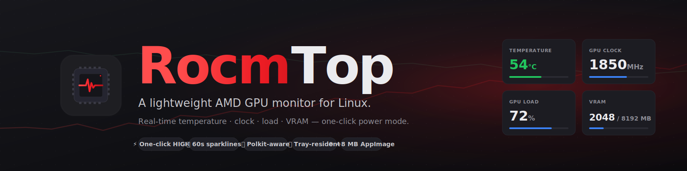

<div align="center">

<a href="https://twarga.github.io/RocmTop/">
  
</a>

<p>
  <a href="https://github.com/Twarga/RocmTop/releases/latest">
    
  </a>
  <a href="https://github.com/Twarga/RocmTop/releases">
    
  </a>
  <a href="https://github.com/Twarga/RocmTop/actions/workflows/ci.yml">
    
  </a>
  <a href="https://twarga.github.io/RocmTop/">
    
  </a>
  <a href="LICENSE">
    
  </a>
  <a href="https://www.rust-lang.org">
    
  </a>
  <a href="https://react.dev">
    
  </a>
  <a href="https://tauri.app">
    
  </a>
</p>

<p>
  <a href="https://twarga.github.io/RocmTop/"><b>Landing</b></a> ·
  <a href="https://github.com/Twarga/RocmTop/releases"><b>Releases</b></a> ·
  <a href="CHANGELOG.md"><b>Changelog</b></a> ·
  <a href="https://github.com/Twarga/RocmTop/issues"><b>Issues</b></a> ·
  <a href="CONTRIBUTING.md"><b>Contributing</b></a>
</p>

</div>

---

## 📦 What's new in v1.0.1

- 🐛 **WebKitGTK flicker fix** — The DMA-BUF renderer bug on Arch / CachyOS / Fedora 40+ is now worked around automatically. No more blank white window.
- 📝 **Troubleshooting entry** — README and landing page both document the X11 fallback (`GDK_BACKEND=x11`) for edge cases.

See the full [CHANGELOG](CHANGELOG.md).

---

## Table of contents

- [Features](#-features)
- [Quick start](#-quick-start)
- [Usage](#-usage)
- [How it works](#-how-it-works)
- [Build from source](#-build-from-source)
- [Troubleshooting](#-troubleshooting)
- [Roadmap](#-roadmap)
- [Contributing](#-contributing)
- [License](#-license)

---

## ✨ Features

| | Feature | Description |
|---|---|---|
| 📊 | **Live GPU metrics** | Temperature, core clock, GPU busy %, and VRAM used/total — polled every 2 s |
| 🌡️ | **Colour-coded temps** | Green under 80 °C, amber 80–88, red above — at a glance |
| 📈 | **60 s sparklines** | Rolling history chart per metric, no library needed |
| ⚡ | **One-click Power Mode** | Toggle between HIGH (pinned max DPM) and AUTO (driver-scaled) |
| 💤 | **One-click Runtime PM** | ON (low-latency) vs AUTO (power-saving) via PCI `power/control` |
| 🤖 | **AI Session preset** | Flip HIGH + PM ON together before a workload, restore both with one click |
| 🔐 | **Polkit-aware** | If sysfs writes fail with permission denied, prompts via `pkexec` instead of silently failing |
| 🔍 | **Auto-detects your GPU** | Scans `/sys/class/drm/cardN` for vendor `0x1002`, derives PCI path — no config file |
| 🖥️ | **System tray** | Close the window → lives in tray; left-click to toggle, right-click for menu |
| 🎨 | **Desktop-grade UI** | Smooth animated values, sparkline charts, skeleton loader, hover tooltips, toast confirmations |
| ⚙ | **~8 MB AppImage** | Single-file download, no dependencies beyond WebKitGTK and the tray library |

---

## 🚀 Quick start

### Download the AppImage

Grab the latest build from the [Releases page](https://github.com/Twarga/RocmTop/releases/latest):

```bash
chmod +x RocmTop_*.AppImage
./RocmTop_*.AppImage
```

### Install system dependencies

RocmTop uses WebKitGTK and the libayatana-appindicator tray library. Most desktops already ship these; if not:

<details>
<summary><strong>Arch / CachyOS / Manjaro</strong></summary>

```bash
sudo pacman -S webkit2gtk-4.1 libayatana-appindicator polkit
```
</details>

<details>
<summary><strong>Ubuntu / Debian / Pop!_OS</strong></summary>

```bash
sudo apt install libwebkit2gtk-4.1-0 libayatana-appindicator3-1 policykit-1
```
</details>

<details>
<summary><strong>Fedora / Nobara</strong></summary>

```bash
sudo dnf install webkit2gtk4.1 libayatana-appindicator-gtk3 polkit
```
</details>

---

## 📖 Usage

1. Launch the AppImage. The window shows four live metric cards plus a status section for Power Mode, Runtime PM, and charger state.
2. Hover over a label (e.g. "Runtime PM") for a tooltip explaining what each mode does.
3. Click a toggle. If the write requires root, a polkit prompt appears.
4. Close the window — the app hides into the tray and keeps polling. Quit from the tray menu when you're done.

```
┌─────────────────────────────────────────┐
│  🌡️ 54°C    ⏱ 1850 MHz   ⚡ 72%    🗄️ 2GB│
│  ████████░░░░░░░░░░  ██████████░░░░░░  │
│                                         │
│  ⚡ Power Mode           ○ AUTO  ● HIGH  │
│  💤 Runtime PM          ● ON    ○ AUTO  │
│  🔋 Charger                           ✔ │
│                                         │
│  🤖 [Start AI Session]                 │
│  ┌─────────────────────────────────┐   │
│  │ 📈      temp         ▁▄▆█▇▆▄▃    │   │
│  │ 📈      clock        ▃▅▇█▇▅▃▁    │   │
│  │ 📈      load         ▁▃▅█▅▃▁▃    │   │
│  │ 📈      vram         ▂▄▆█▆▄▂▁    │   │
│  └─────────────────────────────────┘   │
└─────────────────────────────────────────┘
```

**Pro tip:** before launching a ROCm / PyTorch / llama.cpp session, hit **Start AI Session**. When you're finished, hit **End AI Session** to return the GPU to AUTO.

---

## 🏗 How it works

RocmTop is a thin wrapper around `/sys/class/drm/cardN/device/…` and `/sys/bus/pci/devices/…/power/control`. There is no elevated daemon — the app runs entirely as your user.

```
┌────────────────────────────┐          ┌─────────────────────────────┐
│  React UI (TypeScript)     │          │  Rust backend (Tauri v2)    │
│  • AnimatedNumber, Spark.. │ ◄──IPC── │  • Auto-detects card/PCI    │
│  • Toast + Tooltip         │          │  • Polls sysfs every 2 s    │
│  • 60 s rolling history    │          │  • pkexec fallback          │
└────────────────────────────┘          │  • System tray + menu       │
                                        └──────────┬──────────────────┘
                                                   │
                                          /sys/class/drm/card1/device
                                          /sys/bus/pci/devices/.../power
```

**Stack:** Rust · Tauri v2 · React 18 · TypeScript · Vite · sysfs · PolicyKit

---

## 🛠 Build from source

```bash
# Prerequisites (Arch example)
sudo pacman -S rust nodejs npm webkit2gtk-4.1 libayatana-appindicator

git clone https://github.com/Twarga/RocmTop.git
cd RocmTop
npm install

# Dev with hot reload
npm run tauri dev

# Release AppImage (output in src-tauri/target/release/bundle/appimage/)
npm run tauri build
```

---

## 🔧 Troubleshooting

**The tray icon doesn't appear.**
Install `libayatana-appindicator3` for your distro (see [Quick start](#-quick-start)). On GNOME you may also need the [AppIndicator extension](https://extensions.gnome.org/extension/615/appindicator-support/).

**Toggles say "permission denied" but no polkit prompt appears.**
Install `polkit` and a PolicyKit authentication agent appropriate for your desktop (e.g. `polkit-gnome` on GNOME, `lxqt-policykit` on LXQt, `polkit-kde-agent` on KDE). As a last resort you can `sudo chmod a+w` the affected sysfs node for the current boot.

**All values show 0.**
Either no AMD GPU is present or the `amdgpu` driver isn't loaded. Check `lspci -nn | grep -Ei 'vga|3d'` — vendor `1002` means AMD. Then `dmesg | grep -i amdgpu` to confirm the driver loaded.

**Window opens but everything is blank.**
WebKitGTK is missing or corrupted. Reinstall `webkit2gtk-4.1` and relaunch.

**Window flickers or stays white on Arch / CachyOS / Fedora 40+.**
This is a WebKitGTK 2.48+ DMA-BUF renderer bug. RocmTop v1.0.1+ works around it automatically by setting `WEBKIT_DISABLE_DMABUF_RENDERER=1` before launching the webview. If you're still seeing it, you can also try forcing X11:

```bash
GDK_BACKEND=x11 ./RocmTop_*.AppImage
```

---

## 🗺 Roadmap

- [ ] Settings panel (polling interval, launch at startup, theme)
- [ ] Custom temperature thresholds
- [ ] Light theme
- [ ] Fan speed reading where exposed
- [ ] Multi-GPU support (currently uses the first AMD card found)
- [ ] Flatpak build
- [ ] AUR package (`rocmtop-bin`)

See [issues](https://github.com/Twarga/RocmTop/issues) for active work.

---

## 🤝 Contributing

See [CONTRIBUTING.md](CONTRIBUTING.md). Short version: small focused PRs, `cargo fmt` + `cargo clippy -D warnings` + `cargo test` must pass, and the change should fit [the stated scope](CONTRIBUTING.md#scope-reminder).

All interactions are governed by the [Code of Conduct](CODE_OF_CONDUCT.md).

---

## 📄 License

[MIT](LICENSE) © 2026 Twarga

---

## 🙏 Acknowledgements

- [Tauri](https://tauri.app/) for making a tiny Rust-backed webview app possible.
- The amdgpu kernel maintainers for exposing every metric this app needs via plain text files.

---

<div align="center">
Made with ☕ by <a href="https://github.com/Twarga">Twarga</a>
</div>
