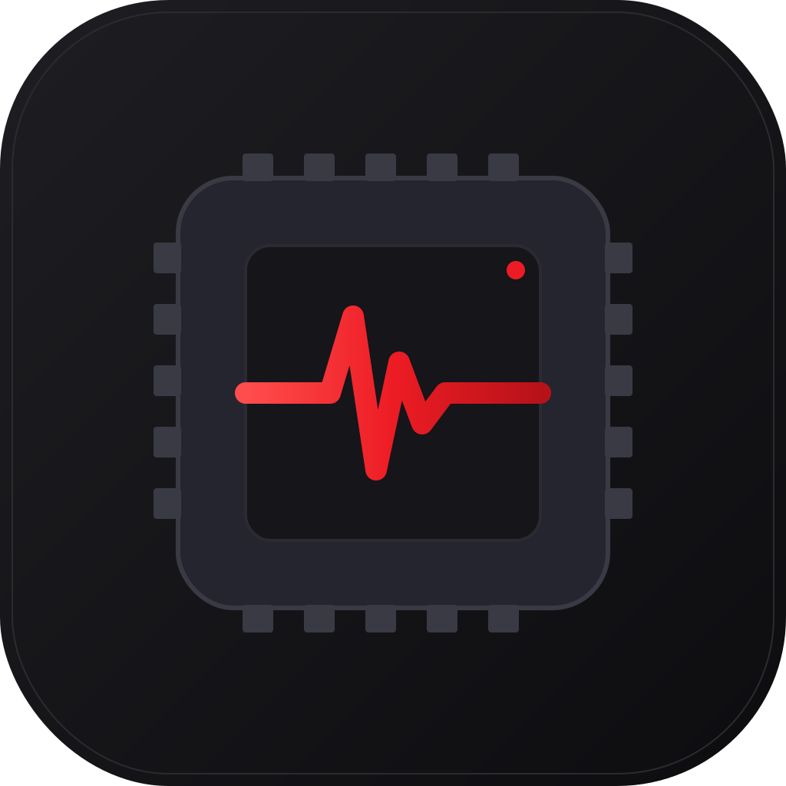

<div align="center">
  

  <h1>RocmTop</h1>

  <p>
    <strong>A lightweight AMD GPU monitor for Linux.</strong><br/>
    Real-time temperature, clock, load, and VRAM — plus one-click power-mode
    switching — in a tray-resident mini app.
  </p>

  <p>
    <a href="https://github.com/Twarga/RocmTop/actions/workflows/ci.yml">
      
    </a>
    <a href="https://github.com/Twarga/RocmTop/releases/latest">
      
    </a>
    <a href="https://github.com/Twarga/RocmTop/releases">
      
    </a>
    <a href="LICENSE">
      
    </a>
    
    
  </p>
</div>

<!--
  Add a demo GIF or PNG to docs/screenshots/ and reference it here, e.g.:
  
-->

---

## Why

`nvtop`, `radeontop`, and `corectrl` are excellent — and all a bit much for
the question "*is my GPU throttling, and can I pin it to HIGH for the next
10 minutes while I run an inference script?*"

RocmTop answers that question in a 420 × 640 window with four live dials, a
one-click **Power Mode** toggle, and a **Runtime PM** toggle — then stays out
of the way in your system tray.

## Features

- 📊 **Live GPU metrics** (polled every 2 s): temperature, core clock, busy %,
  VRAM used/total.
- 🌡️ **Colour-coded temperature zones** — green under 80 °C, amber 80–88, red
  above.
- 📈 **60-second sparkline history** per metric.
- ⚡ **One-click Power Mode** — toggle between HIGH (pinned max DPM) and AUTO
  (driver-scaled).
- 💤 **One-click Runtime PM** — ON (low-latency) vs AUTO (power-saving).
- 🤖 **AI Session preset** — flip HIGH + PM ON together before a workload,
  then restore both with one click.
- 🔍 **Auto-detects your GPU** — scans `/sys/class/drm/cardN` for vendor
  `0x1002` and derives the PCI path from the device symlink. No config file.
- 🔐 **Polkit-aware** — if writing to sysfs fails with permission denied, the
  app prompts via `pkexec` instead of silently failing.
- 🖥️ **System tray** — close the window and it lives in the tray; left-click
  to toggle, right-click for a menu.
- 🎨 **Feels like a desktop app** — smooth animated values, sparkline charts,
  skeleton loader, hover tooltips, toast confirmations.

## Install

### Download the AppImage

Grab the latest build from the
[Releases page](https://github.com/Twarga/RocmTop/releases/latest):

```bash
chmod +x RocmTop_*.AppImage
./RocmTop_*.AppImage
```

### Install system dependencies

RocmTop uses WebKitGTK and the libayatana-appindicator tray library. Most
desktops already ship these; if not:

<details>
<summary><strong>Arch / CachyOS / Manjaro</strong></summary>

```bash
sudo pacman -S webkit2gtk-4.1 libayatana-appindicator polkit
```
</details>

<details>
<summary><strong>Ubuntu / Debian / Pop!_OS</strong></summary>

```bash
sudo apt install libwebkit2gtk-4.1-0 libayatana-appindicator3-1 policykit-1
```
</details>

<details>
<summary><strong>Fedora / Nobara</strong></summary>

```bash
sudo dnf install webkit2gtk4.1 libayatana-appindicator-gtk3 polkit
```
</details>

## Usage

1. Launch the AppImage. The window shows four live metric cards plus a status
   section for Power Mode, Runtime PM, and charger state.
2. Hover over a label (e.g. "Runtime PM") for a tooltip explaining what each
   mode does.
3. Click a toggle. If the write requires root, a polkit prompt appears.
4. Close the window — the app hides into the tray and keeps polling. Quit
   from the tray menu when you're done.

**Pro tip:** before launching a ROCm / PyTorch / llama.cpp session, hit
**Start AI Session**. When you're finished, hit **End AI Session** to return
the GPU to AUTO.

## How it works

RocmTop is a thin wrapper around `/sys/class/drm/cardN/device/…` and
`/sys/bus/pci/devices/…/power/control`. There is no elevated daemon — the
app runs entirely as your user. The backend is Rust (~500 LoC including
tests), the frontend is TypeScript + React (no UI framework, no chart
library, no animation library).

```
┌────────────────────────────┐          ┌─────────────────────────────┐
│  React UI (TypeScript)     │          │  Rust backend (Tauri v2)    │
│  • AnimatedNumber, Spark.. │ ◄──IPC── │  • Auto-detects card/PCI    │
│  • Toast + Tooltip         │          │  • Polls sysfs every 2 s    │
│  • 60 s rolling history    │          │  • pkexec fallback          │
└────────────────────────────┘          │  • System tray + menu       │
                                        └──────────┬──────────────────┘
                                                   │
                                          /sys/class/drm/card1/device
                                          /sys/bus/pci/devices/.../power
```

## Build from source

```bash
# Prerequisites (Arch example)
sudo pacman -S rust nodejs npm webkit2gtk-4.1 libayatana-appindicator

git clone https://github.com/Twarga/RocmTop.git
cd RocmTop
npm install

# Dev with hot reload
npm run tauri dev

# Release AppImage (output in src-tauri/target/release/bundle/appimage/)
npm run tauri build
```

## Troubleshooting

**The tray icon doesn't appear.**
Install `libayatana-appindicator3` for your distro (see above). On GNOME you
may also need the
[AppIndicator extension](https://extensions.gnome.org/extension/615/appindicator-support/).

**Toggles say "permission denied" but no polkit prompt appears.**
Install `polkit` and a PolicyKit authentication agent appropriate for your
desktop (e.g. `polkit-gnome` on GNOME, `lxqt-policykit` on LXQt, `polkit-kde-agent`
on KDE). As a last resort you can `sudo chmod a+w` the affected sysfs node
for the current boot.

**All values show 0.**
Either no AMD GPU is present or the `amdgpu` driver isn't loaded. Check
`lspci -nn | grep -Ei 'vga|3d'` — vendor `1002` means AMD. Then `dmesg |
grep -i amdgpu` to confirm the driver loaded.

**Window opens but everything is blank.**
WebKitGTK is missing or corrupted. Reinstall `webkit2gtk-4.1` and relaunch.

## Roadmap

- [ ] Settings panel (polling interval, launch at startup, theme)
- [ ] Custom temperature thresholds
- [ ] Light theme
- [ ] Fan speed reading where exposed
- [ ] Multi-GPU support (currently uses the first AMD card found)
- [ ] Flatpak build
- [ ] AUR package (`rocmtop-bin`)

See [issues](https://github.com/Twarga/RocmTop/issues) for active work.

## Contributing

See [CONTRIBUTING.md](CONTRIBUTING.md). Short version: small focused PRs,
`cargo fmt` + `cargo clippy -D warnings` + `cargo test` must pass, and the
change should fit [the stated scope](CONTRIBUTING.md#scope-reminder).

All interactions are governed by the
[Code of Conduct](CODE_OF_CONDUCT.md).

## License

[MIT](LICENSE) © 2026 Twarga

## Acknowledgements

- [Tauri](https://tauri.app/) for making a tiny Rust-backed webview app possible.
- The amdgpu kernel maintainers for exposing every metric this app needs via
  plain text files.
